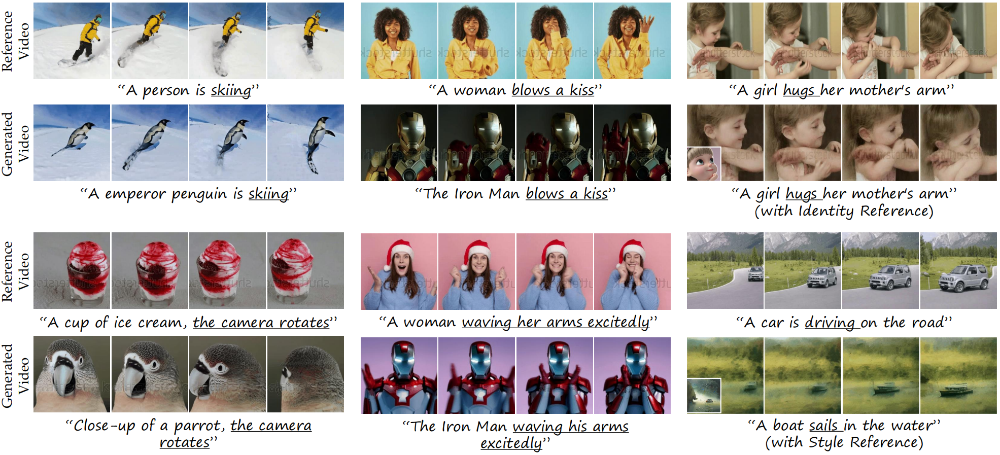

# MotionCrafter
Official implementation of the paper "MotionCrafter: One-Shot Motion Customization of Diffusion Models"

<!--  -->

The essence of a video lies in its dynamic motions, including character actions, object movements, and camera movements. 
While text-to-video generative diffusion models have recently advanced in creating diverse contents, controlling specific motions through text prompts remains a significant challenge.
A primary issue is the coupling of appearance and motion, often leading to overfitting on appearance.
To tackle this challenge, we introduce MotionCrafter, a novel one-shot instance-guided motion customization method.
MotionCrafter employs a parallel spatial-temporal architecture that injects the reference motion into the temporal component of the base model, while the spatial module is independently adjusted for character or style control.
To enhance the disentanglement of motion and appearance, we propose an innovative dual-branch motion disentanglement approach, comprising a motion disentanglement loss and an appearance prior enhancement strategy.
During training, a frozen base model provides appearance normalization, effectively separating appearance from motion and thereby preserving diversity.
Comprehensive quantitative and qualitative experiments, along with user preference tests, demonstrate that MotionCrafter can successfully integrate dynamic motions while preserving the coherence and quality of the base model with a wide range of appearance generation capabilities.
For details see the [paper](http://arxiv.org/abs/2312.05288) 
